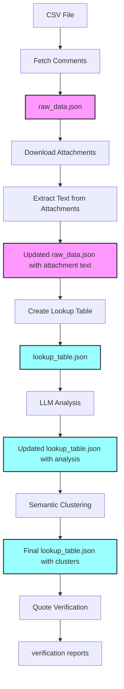

# Schedule F Comments Analysis

A tool for analyzing public comments on the proposed "Schedule F" rule.

## Project Structure

```
regs/
├── backend/                    # Backend Python code
│   ├── fetch/                  # Data fetching modules
│   │   ├── fetch_comments.py   # Fetch comments from regulations.gov API
│   │   └── analyze_attachments.py # Extract text from attachments
│   ├── analysis/               # Analysis modules
│   │   ├── create_lookup_table.py # Create deduplicated lookup table
│   │   ├── analyze_lookup_table.py # LLM analysis of comments
│   │   ├── hierarchical_clustering.py # Semantic clustering
│   │   ├── verify_lookup_quotes.py # Quote verification
│   │   └── semantic_lookup.py  # Semantic search utilities
│   ├── utils/                  # Shared utilities
│   │   ├── comment_analyzer.py # LLM interface for analysis
│   │   ├── logging_config.py   # Centralized logging
│   │   └── validate_pipeline_output.py # Output validation
│   ├── pipeline.py             # Main fresh analysis pipeline
│   ├── resume_pipeline.py      # Incremental update pipeline
│   └── config.py               # Configuration settings
├── data/                       # Data directory (generated)
│   ├── raw_data.json           # All fetched comments
│   ├── lookup_table.json       # Deduplicated entries with analysis
│   ├── attachments/            # Downloaded attachment files
│   └── cluster/                # Clustering visualizations
├── frontend/                   # Next.js web application
│   ├── src/                    # Frontend source code
│   │   ├── app/                # Next.js app router pages
│   │   ├── components/         # React components
│   │   └── lib/                # Frontend utilities
│   └── scripts/                # Frontend utility scripts
├── json-schemas/               # JSON schema definitions
│   ├── data.schema.json        # Schema for data.json
│   └── lookup_table.schema.json # Schema for lookup_table.json
├── scripts/                    # Pipeline utility scripts
├── tests/                      # Test suite
└── requirements.txt            # Python dependencies
```

## Setup

### Install Requirements

```bash
# Install Python dependencies
pip install -r requirements.txt

# Install frontend dependencies
cd frontend
npm install
```

### Environment Variables

Create a `.env` file in the project root with:

```
# For fetching comments
REGS_API_KEY=your_regulations_gov_api_key

# For analyzing comments
OPENAI_API_KEY=your_openai_api_key

# For attachment processing (optional)
GEMINI_API_KEY=your_gemini_api_key
```

## Usage

### Running the Analysis Pipeline

#### Fresh Analysis (from scratch)
```bash
# Run complete pipeline on CSV file
python backend/pipeline.py --csv comments.csv --output_dir results_2024

# With options
python backend/pipeline.py --csv comments.csv --output_dir results_2024 \
  --model gpt-4o-mini --truncate 1000 --skip-clustering
```

#### Incremental Updates (resume)
```bash
# Resume from existing data
python backend/resume_pipeline.py --csv comments.csv \
  --raw_data data/raw_data.json --lookup_table data/lookup_table.json \
  --truncate 1003

# Skip analysis (just fetch new comments)
python backend/resume_pipeline.py --csv comments.csv \
  --raw_data data/raw_data.json --lookup_table data/lookup_table.json \
  --skip-analysis
```

#### Individual Analysis Steps
```bash
# Just create lookup table
python backend/analysis/create_lookup_table.py --input raw_data.json \
  --output lookup_table.json --truncate 1000

# Just run LLM analysis
python backend/analysis/analyze_lookup_table.py --input lookup_table.json

# Just run clustering
python backend/analysis/hierarchical_clustering.py --input lookup_table.json
```

### Pipeline Options

#### Common Options
- `--csv comments.csv` - Input CSV file with comment data
- `--output_dir results/` - Output directory for results
- `--model gpt-4o-mini` - LLM model for analysis (default: gpt-4o-mini)
- `--truncate 1000` - Truncate text to N characters for analysis
- `--limit 100` - Process only first N comments (for testing)

#### Fresh Pipeline Options
- `--skip-analysis` - Skip LLM analysis (only fetch and deduplicate)
- `--skip-clustering` - Skip semantic clustering step

#### Resume Pipeline Options  
- `--raw_data path/to/raw_data.json` - Existing raw data file
- `--lookup_table path/to/lookup_table.json` - Existing lookup table
- `--skip-analysis` - Only fetch new comments (no LLM analysis)
- `--skip-clustering` - Skip clustering step

**Note**: Quote verification runs automatically after LLM analysis to verify extracted quotes exist in original text.


### Frontend Development

```bash
# Start development server
cd frontend
npm run dev
```

### Testing

The project includes a comprehensive test suite covering all major functionality:

```bash
# Run all tests
cd tests
python run_tests.py

# Run specific test categories
python -m unittest test_pipeline.TestPipelineIntegration -v
python -m unittest test_pipeline.TestRealAPIIntegration -v
```

The test suite includes:
- Data fetching and CSV parsing
- Lookup table creation and deduplication
- LLM analysis (with mock mode for CI)
- Clustering and visualization
- Resume pipeline functionality
- Attachment processing with Gemini API
- Schema validation
- End-to-end workflow testing

## Architecture

This project consists of five main components:

1. **Data Fetching**: Python scripts to fetch comments and attachments from regulations.gov API
2. **Text Extraction**: Smart extraction from PDFs, DOCX, images with Gemini API fallback  
3. **Analysis**: Python scripts using LLMs to analyze deduplicated comment text
4. **Clustering**: Semantic clustering to group similar comments
5. **Frontend**: Next.js application to view and search comments

### Data Flow



**Pipeline Steps:**

1. **Fetch**: Read comments from CSV → `raw_data.json` (all comments with metadata)
2. **Attachments**: Download and extract text from attachments → update `raw_data.json`
3. **Deduplicate**: Create `lookup_table.json` with unique text patterns
4. **Analyze**: LLM analysis adds stance, themes, quotes directly to `lookup_table.json`
5. **Cluster**: Semantic clustering adds cluster information to `lookup_table.json`
6. **Verify**: Quote verification creates separate verification reports
7. **View**: Frontend displays the analyzed data

### Key Files

- **`raw_data.json`**: All fetched comments with full metadata and attachment text
- **`lookup_table.json`**: Deduplicated text patterns with complete analysis (stance, themes, quotes, clusters)
- **`lookup_table_quote_verification.json`**: Quote verification results
- **`data.json`**: Merged dataset created by `scripts/merge_data.sh` that combines raw_data.json with lookup_table.json for frontend compatibility

### Deduplication Strategy

The system reduces redundant LLM analysis significantly:
- Comments with identical/similar text (after normalization) share one lookup entry
- Each lookup entry has a `comment_ids` array listing all matching comments  
- Analysis (expensive LLM calls) only happens once per unique text pattern
- Typical efficiency: Analyze ~21,000 unique patterns instead of ~28,000 total comments
- Speed improvement: ~25% reduction in API calls and analysis time

## Pipeline Details

### Fresh Pipeline (`pipeline.py`)
1. Fetches all comments from CSV → `raw_data.json`
2. Downloads and extracts attachments (PDF, DOCX, images)
3. Creates deduplicated `lookup_table.json` from scratch
4. Runs LLM analysis on unique text patterns (updates `lookup_table.json` in place)
5. Performs semantic clustering (adds cluster data to `lookup_table.json`)
6. Runs quote verification and creates verification reports
7. Outputs to specified directory

### Resume Pipeline (`resume_pipeline.py`)
1. Compares CSV with existing `raw_data.json` to find new comments
2. Fetches only new comments and appends to `raw_data.json`
3. Downloads attachments for new comments
4. Updates existing `lookup_table.json` with new text patterns
5. Preserves all existing analysis and only analyzes new patterns
6. Runs clustering and verification on the complete dataset
7. Maintains perfect consistency with existing deduplication

### Output Structure

Each pipeline run creates output in the specified directory containing:
- `raw_data.json` - All comments with attachment text
- `lookup_table.json` - Deduplicated entries with complete analysis (stance, themes, quotes, clusters)
- `lookup_table_quote_verification.json` - Quote verification results
- `lookup_table_quote_verification.txt` - Human-readable verification report
- `pipeline.log` or `resume_pipeline.log` - Execution log
- `attachments/` - Downloaded attachment files with extracted text
- `cluster/` - Clustering visualizations and reports (if clustering enabled)
  - `hierarchical_cluster_report.txt` - Detailed cluster analysis
  - `hierarchical_clusters_visualization.png` - Cluster visualization
  - `main_dendrogram.png` - Hierarchical clustering dendrogram
  - `main_elbow_curve.png` - Elbow curve for optimal clusters
  - `cluster_descriptions.json` - AI-generated cluster descriptions

### Creating data.json for Frontend

After running the pipeline, create `data.json` by merging the lookup table with raw data:

```bash
# Merge data in the default data/ directory
./scripts/merge_data.sh

# Or specify a custom directory
./scripts/merge_data.sh results/results_20250605

# The script will:
# 1. Validate that raw_data.json and lookup_table.json exist
# 2. Merge lookup analysis into each comment
# 3. Clean up any schema compliance issues
# 4. Validate the output against the JSON schema
# 5. Create data.json in the same directory
```

## Limitations

This analysis system has two notable limitations:

### Attachment Processing
- Not all attachments are successfully processed. Some PDFs, images, or other file types may fail text extraction even with Gemini API fallback, or result in garbled attachment content. However, this affects a very small percentage of comments.

### Model Categorization Accuracy
- The LLM categorization is not perfect. Comments were much wider than expected in terms of content: there were some that we weren't even sure how to categorize doing manual review, which wasn't practical to do in general: we mainly used that to tweak the prompt, which you can see here: [backend/utils/comment_analyzer.py](backend/utils/comment_analyzer.py#L68-L127)  

### Impact on Results
- We believe these limitations don't significantly affect the top-level findings
- The main impact is likely on the "neutral" category - manual review would probably recategorize many neutral comments as having a stance, making the already small neutral percentage even lower. 

## License

MIT